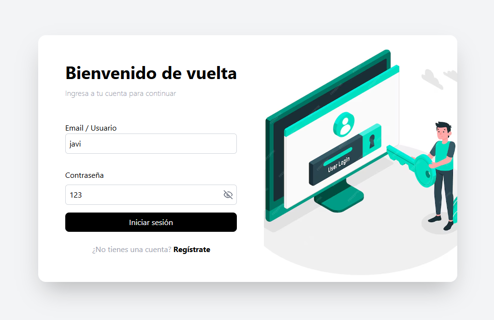
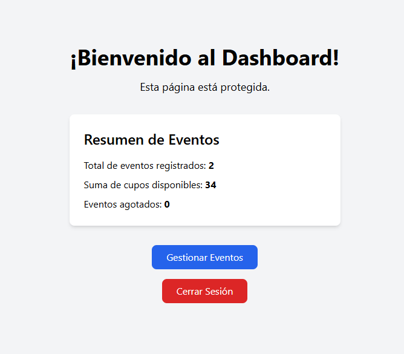
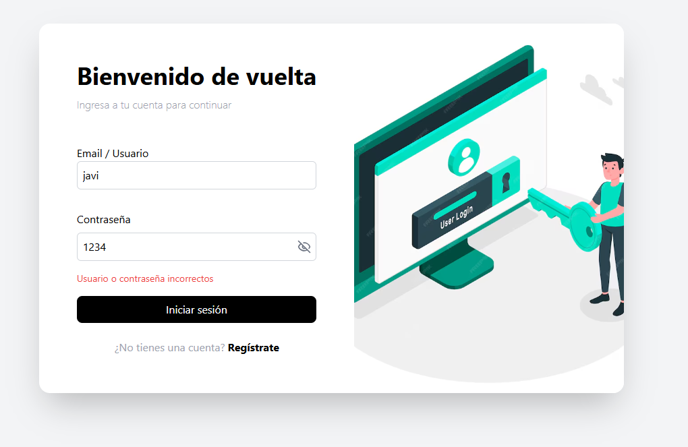
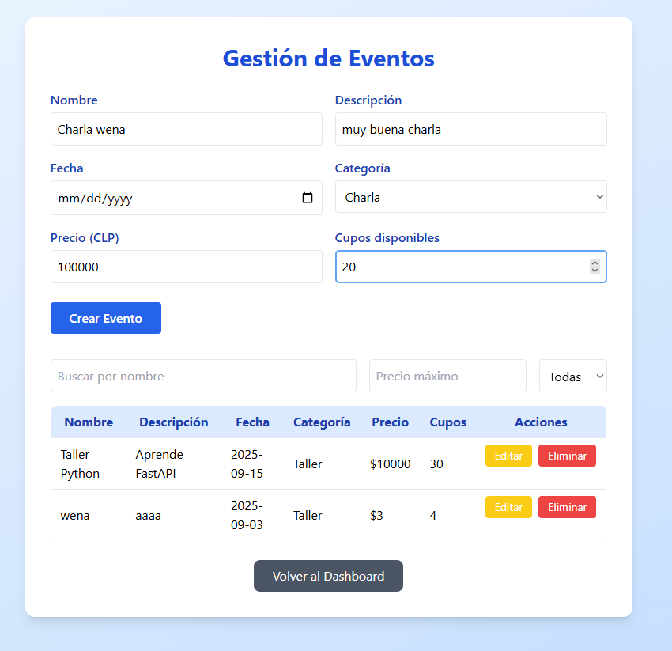
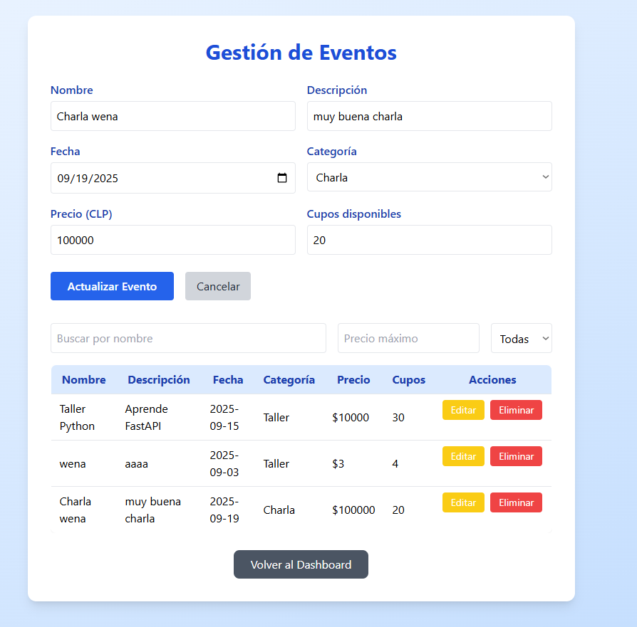
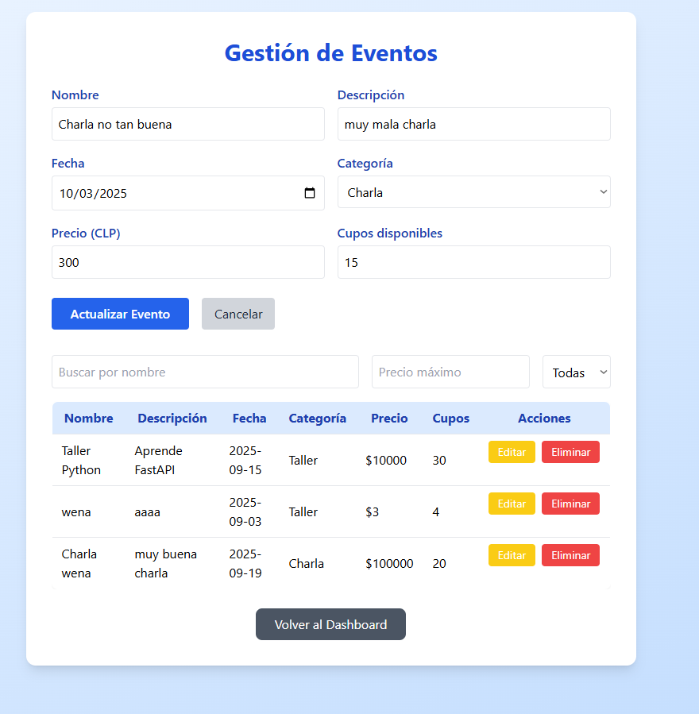
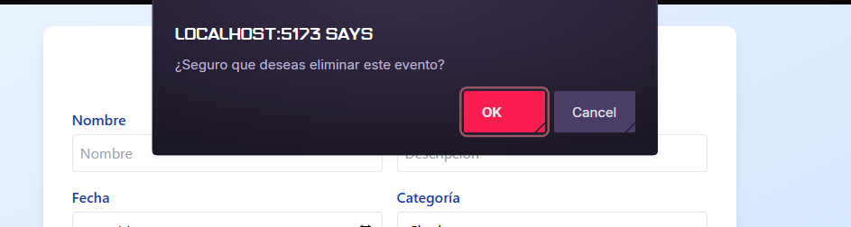

# 📄 Ejercicio – Gestión de Entradas para Micro-Eventos

- **Proyecto:** Gestión de Entradas para Micro-Eventos
- **Integrantes:** Javiera Osorio – Muryel
- **Curso:** Pruebas de Software
- **Profesor(a):** Oscar Reyes
- **Fecha de entrega:** 10/09/2025
- 📎 **Organización en GitHub:** [https://github.com/Pruebas-de-Software-Tareas](https://github.com/Pruebas-de-Software-Tareas)

## 2. Especificación de Requerimientos (Validación)
El enunciado inicial presentaba requisitos generales. Para evitar ambigüedades, definimos lo siguiente:

- **Eventos:** nombre, descripción, fecha, categoría (Charla, Taller, Show), precio de entrada (entero) y cupos disponibles (entero).
- **CRUD:** crear, editar, listar y eliminar eventos.
- **Autenticación:** solo usuarios autenticados pueden gestionar eventos y registrar ventas/devoluciones.
- **Filtrado y búsqueda:** por categoría, nombre o fecha.
- **Reportes:** deben mostrar:
  - Total de eventos registrados
  - Total de cupos disponibles
  - Eventos agotados
- **Ventas y devoluciones:** venta disminuye en 1 los cupos, devolución aumenta en 1.

---

## 3. Aseguramiento del Requerimiento (Verificación)
Para verificar que el sistema cumple lo anterior, aplicamos:

- **Pruebas funcionales manuales** (casos de prueba documentados).
- **Evidencias:** capturas de pantalla del frontend y del flujo de trabajo en GitHub.
- **Ciclos de prueba:** individuales y en conjunto, siguiendo la metodología solicitada.

---

## 4. Organización y Flujo de Trabajo
- **Repositorios:**
  - Frontend (React): [enlace repo frontend]
  - Backend (Java/Python): [enlace repo backend]
  - Ambos bajo una organización en GitHub.

- **Administración de código:**
  - Rama `main` protegida, requiriendo al menos una revisión para hacer merge.
  - El desarrollo se realiza en ramas de features (`feature/nombre-funcionalidad`).
  - Se utilizan Pull Requests (PRs) revisados por el compañero antes de integrar a la rama `develop` o `main`.
  - Notificaciones de commits y PRs integradas con un canal de Slack.

- **Evidencia:**
  - *Ver sección de Anexos para capturas de configuración de ramas, Pull Requests y la integración con Slack.*

---

## 5. Problemas Encontrados y Soluciones
- **Problema 1:** Fallo de conexión entre frontend y backend.
  - *Solución:* Habilitar CORS en backend.
- **Problema 2:** Reporte mostraba cupos incorrectos.
  - *Solución:* Ajuste en la consulta SQL/ORM.
- **Problema 3:** El filtrado no actualizaba dinámicamente.
  - *Solución:* Uso de hooks en React con `useState` y `useEffect`.

---

## 6. Pruebas Realizadas

A continuación, se presenta un resumen de los casos de prueba ejecutados. La evidencia detallada para cada uno se encuentra en la sección de Anexos.

| Id_Test | Entrada al sistema | Resultado esperado | Veredicto | Evidencia Detallada |
| :--- | :--- | :--- | :--- | :--- |
| **T1** | Iniciar sesión con credenciales válidas (`admin/1234`) | Acceso permitido → pantalla principal | ✅ Éxito | [Ver Anexo T1](#T1) |
| **T2** | Iniciar sesión con credenciales incorrectas (`admin/xxxx`) | Sistema debe rechazar con mensaje de error | ✅ Éxito | [Ver Anexo T2](#T2) |
| **T3** | Registrar evento (Charla IA, 20 cupos, $5000) | Evento se muestra en el listado | ✅ Éxito | [Ver Anexo T3](#T3) |
| **T4** | Modificar evento (precio a $6000) | Se actualiza correctamente | ✅ Éxito | [Ver Anexo T4](#T4) |
| **T5** | Eliminar evento existente | Evento ya no aparece en lista | ✅ Éxito | [Ver Anexo T5](#T5) |
| **T6** | Filtrar por categoría “Taller” | Se listan solo talleres | ⚪ Pendiente | [Ver Anexo T6](#T6) |
| **T7** | Vender entrada en evento con cupos | Cupos disminuyen en 1 | ⚪ Pendiente | [Ver Anexo T7](#T7) |
| **T8** | Devolver entrada previamente vendida | Cupos aumentan en 1 | ⚪ Pendiente | [Ver Anexo T8](#T8) |
| **T9** | Generar reporte con varios eventos | Reporte muestra totales y agotados | ⚪ Pendiente | [Ver Anexo T9](#T9) |
| **T10**| Crear evento con cupos = 0 | Evento debe marcarse como “Agotado” | ⚪ Pendiente | [Ver Anexo T10](#T10)|

---

## 7. Conclusiones
- El sistema implementa correctamente los requisitos definidos.
- Se validaron los flujos principales: login, CRUD de eventos, filtros, reportes, ventas y devoluciones.
- El control de versiones con GitHub y Slack permitió un flujo ordenado.
- Trabajo futuro: integrar pruebas automáticas (Jest/Pytest) y despliegue en la nube.

---

## 8. Anexos: Evidencia Detallada

*(Nota: Las pruebas T1 y T2 corresponden al flujo de Login. Las pruebas T3, T4 y T5 corresponden al CRUD de Eventos, cuyas evidencias se muestran a continuación.)*

### Anexo T1: Login con credenciales válidas
- **Evidencia:**
  *(Evidencia para T1 será agregada por el equipo)*

### Anexo T2: Login con credenciales inválidas
- **Evidencia:**
  *(Evidencia para T2 será agregada por el equipo)*

### Anexo T3: Registrar un nuevo evento
- **Comentario:** Se llena el formulario y se crea un nuevo evento, el cual aparece en la lista con un mensaje de confirmación.
- **Evidencia:**
  1. **Formulario Lleno:**
     
  2. **Resultado Exitoso:**
     

### Anexo T4: Modificar un evento existente
- **Comentario:** Se selecciona un evento, se cargan sus datos en el formulario, se modifican y se guardan los cambios.
- **Evidencia:**
  1. **Carga de Datos para Editar:**
     
  2. **Actualización Exitosa:**
     

### Anexo T5: Eliminar un evento existente
- **Comentario:** Se hace clic en eliminar, se confirma la acción en un diálogo y el evento desaparece de la lista.
- **Evidencia:**
  1. **Diálogo de Confirmación:**
     
  2. **Resultado de Eliminación:**
     
  3. **Validación de Campo Obligatorio (Prueba Adicional):**
     

### Anexo T6: Filtrar por categoría
- **Evidencia:**
  *(Evidencia para T6 será agregada por el equipo)*

### Anexo T7: Vender entrada
- **Evidencia:**
  *(Evidencia para T7 será agregada por el equipo)*

### Anexo T8: Devolver entrada
- **Evidencia:**
  *(Evidencia para T8 será agregada por el equipo)*

### Anexo T9: Generar reporte
- **Evidencia:**
  *(Evidencia para T9 será agregada por el equipo)*

### Anexo T10: Crear evento agotado
- **Evidencia:**
  *(Evidencia para T10 será agregada por el equipo)*